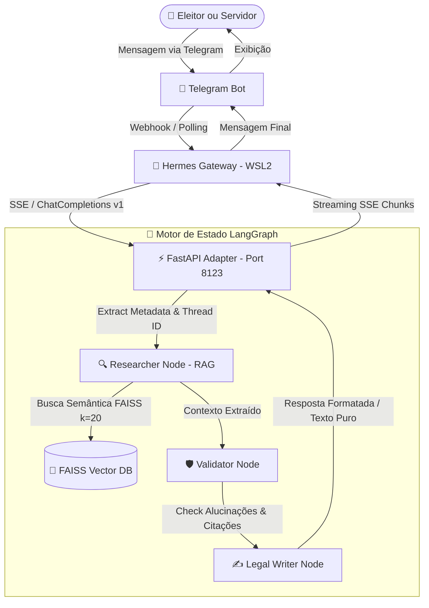

# Agente Virtual do Cartório Eleitoral (TRE-MA) 🗳️🤖

O **Agente Virtual do Cartório Eleitoral** é uma solução de inteligência artificial baseada em **RAG (Retrieval-Augmented Generation)** projetada para auxiliar servidores da Justiça Eleitoral do Maranhão (TRE-MA) e cidadãos (eleitores). O agente atua como um especialista no *Manual de Práticas Cartorárias*, *Resolução TSE nº 23.659/2021*, *Código Eleitoral* e doutrinas correlatas.

A arquitetura do projeto utiliza o **LangGraph** como orquestrador de estado e integra-se de forma desacoplada a múltiplos canais de comunicação usando o **Hermes Gateway** (upstream).

---

## 🏗️ Arquitetura do Sistema

O fluxo de mensagens e processamento segue a topologia abaixo:



---

## ✨ Principais Funcionalidades

### 1. RAG Multi-Documento de Alta Qualidade
*   Busca semântica avançada utilizando **FAISS** e embeddings da OpenAI (`text-embedding-3-small`).
*   Configuração otimizada com `k=20` para garantir a recuperação completa de listas de documentos complexas e tabelas da Resolução de Cadastro (Res. TSE nº 23.659/2021) e manuais de práticas.

### 2. Comportamento de Duas Personas (Dual Persona)
O sistema analisa automaticamente os metadados da conversa para definir a persona:
*   **Modo Servidor**: Focado em produtividade interna. Utiliza a metodologia **BLUF** (Bottom Line Up Front) entregando a ação e o código ASE (Ex: ASE 337) na primeira linha, estruturação top-down baseada na **Pirâmide de Minto** e citações formais.
*   **Modo Eleitor**: Linguagem simplificada e acolhedora baseada em **ELI5** (Explain Like I'm 5). Organiza as orientações em no máximo 3 etapas lógicas (**Regra de Três**) e formata a saída em **Texto Puro** (sem Markdown ou HTML), garantindo a legibilidade em dispositivos móveis.

### 3. Observabilidade e Auditoria (Query Logger)
*   Gravação estruturada de todas as requisições em `data/query_logs.jsonl` contendo: `timestamp`, `thread_id`, `query`, `response` gerada, `persona` classificada, latência (`elapsed_seconds`) e status (`SUCESSO` ou `INCONCLUSIVO`).
*   **Conformidade com a LGPD**: O nó de pesquisa detecta dados pessoais reais (CPF, RG, Título de Eleitor) e injeta preventivamente avisos de privacidade no topo da conversa, sem gravar esses dados sensíveis nos logs do sistema (Data Minimization).

### 4. Auto-Ingestion Pipeline (Directory Watcher)
*   Uma thread assíncrona monitora a pasta `docs/references/` a cada 10 segundos buscando modificações ou novos arquivos PDF.
*   **Otimização por Cache**: Utilização de `CacheBackedEmbeddings` para armazenar o hash dos arquivos processados no disco local (`data/embeddings_cache`). Arquivos inalterados são carregados instantaneamente, evitando custos com a API de embeddings da OpenAI/OpenRouter e eliminando rate-limits.
*   **Reload Sem Downtime**: Atualização dinâmica do Vector Store e do retriever em memória de forma thread-safe sem interromper o serviço FastAPI.

---

## 📂 Estrutura do Projeto

```
telegram-electoral-agent/
├── data/
│   ├── embeddings_cache/   # [Ignorado] Cache local de embeddings
│   ├── faiss_index/         # Banco vetorial FAISS indexado
│   └── query_logs.jsonl    # [Ignorado] Histórico estruturado de consultas
├── docs/
│   ├── ADR/                 # Registro de Decisões Arquiteturais (ADRs)
│   ├── references/          # PDFs de referências (Código Eleitoral, resoluções, etc)
│   └── PRD.md               # Product Requirements Document
├── src/
│   ├── rag/
│   │   ├── ingestion.py     # Ingestão de PDFs e geração de embeddings com cache
│   │   ├── intent.py        # Classificação automática de personas
│   │   ├── researcher.py    # Busca semântica e prompts RAG no LangGraph
│   │   ├── validator_skill.py # Validação jurídica de citações contra alucinações
│   │   └── legal_writer.py  # Formatação e estilização das respostas (Servidor/Eleitor)
│   ├── api.py               # FastAPI Adapter com SSE Streaming, Watcher e Logger
│   ├── bot.py               # Bot clássico standalone (opcional)
│   ├── config.py            # Variáveis e configurações globais
│   └── graph.py             # Configuração e compilação do fluxo LangGraph
├── tests/
│   ├── test_observability.py # Teste integrado de logs e watcher de arquivos
│   ├── test_persona.py      # Teste unitário e de conformidade de personas do LangGraph
│   └── test_retrieval.py    # Script de diagnóstico de busca e similaridade
├── Dockerfile               # Configuração do container para deploy
├── requirements.txt         # Lista de dependências Python
└── project-status.yaml      # Status e progresso do projeto no workspace
```

---

## 🛠️ Configuração e Execução

### Pré-requisitos
*   Python 3.11 instalado.
*   Chave de API da OpenAI ou OpenRouter.
*   Acesso a um bot do Telegram (via BotFather) caso queira integrar o canal.

### 1. Instalação das Dependências
No diretório raiz do projeto, instale os pacotes no seu ambiente virtual:
```bash
pip install -r requirements.txt
```

### 2. Configuração do `.env`
Crie um arquivo `.env` na raiz do projeto (baseie-se no `.env.example` se disponível):
```env
OPENAI_API_KEY=sua-chave-aqui
OPENAI_API_BASE=https://api.openai.com/v1 # Ou endpoint OpenRouter
MODEL_NAME=gpt-4o-mini
EMBEDDING_MODEL=text-embedding-3-small
TELEGRAM_BOT_TOKEN=seu-token-do-bot-aqui
```

### 3. Execução do Servidor FastAPI (Adapter)
Para iniciar o adaptador local que processa o RAG e o streaming de respostas:
```bash
python -m uvicorn src.api:app --host 0.0.0.0 --port 8123
```

---

## 🧪 Validação e Testes

O projeto conta com suítes de testes automatizados para garantir a qualidade de comportamento e infraestrutura:

### Testes de Persona e Conformidade (LangGraph)
Valida a formatação de texto puro para eleitores, a injeção do aviso da LGPD na detecção de CPF e o uso de BLUF/Minto para servidores:
```bash
python -m tests.test_persona
```

### Teste de Observabilidade e Auto-Ingestão (E2E)
Testa se os logs são escritos perfeitamente no formato JSON Lines e se o watcher assíncrono consegue detectar um novo PDF, rodar a ingestão e atualizar a base FAISS em tempo real:
```bash
python -m tests.test_observability
```
