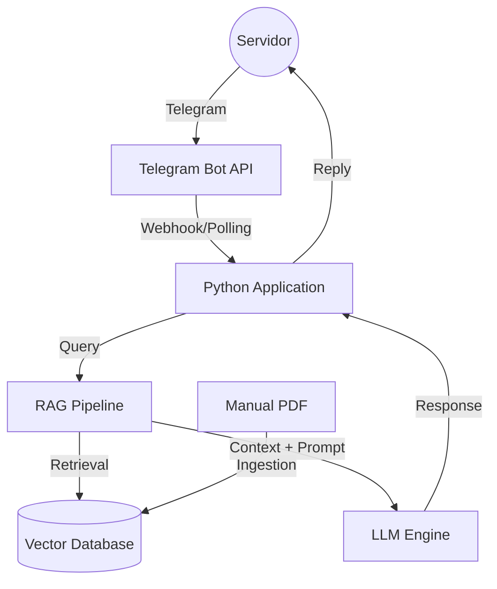

# Architecture Document
**Project**: Agente Telegram Eleitoral
**Author**: @architect (Industrial Squad)

## 1. High-Level Topology


## 2. Technology Stack
*   **Language**: Python 3.10+
*   **Interface**: `python-telegram-bot` (Wrapper oficial maduro)
*   **Orchestration**: `LangChain` ou `LlamaIndex` (para RAG)
*   **Vector Database**: `ChromaDB` (Local e simples)
*   **Embeddings**: `OpenAI Embeddings` (text-embedding-3-small) ou `HuggingFace` (pt-br)
*   **LLM**: `GPT-4o-mini` (Custo-benefício) ou `Claude 3.5 Sonnet` (Precisão)
*   **PDF Parsing**: `PyPDFLoader` ou `Unstructured`

## 3. Data Flow (RAG)
1.  **Ingestion Phase**:
    *   Load PDF -> Extract Text -> Split into Chunks (1000 tokens, 200 overlap).
    *   Generate Embeddings -> Store in ChromaDB.
2.  **Inference Phase**:
    *   User Query -> Generate Embedding.
    *   Similarity Search (Top 3-5 chunks).
    *   System Prompt: "Você é um especialista do TRE-MA. Use APENAS o contexto abaixo."
    *   LLM Generation.

## 4. Directory Structure
```text
src/
├── bot.py             # Entry point do Telegram
├── config.py          # Variáveis de ambiente
├── rag/
│   ├── ingestion.py   # Script de processamento do PDF
│   ├── retrieval.py   # Lógica de busca
│   └── chains.py      # LLM Chain
└── utils/
    └── logger.py
```
